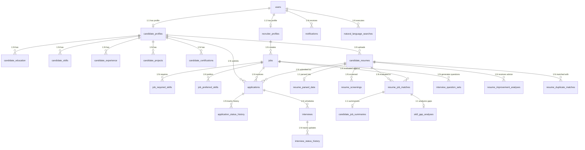

# Resumio Database Architecture & DBMS Academic Specification

## 1. Executive Summary & Database Scope

**Resumio** is an enterprise-grade AI Resume Screening & Recruitment Portal engineered on a relational SQLite database architecture managed via `better-sqlite3`. The database provides ACID-compliant storage for candidate profiles, parsed resumes, job listings, application lifecycles, deterministic AI match scores, interview scheduling, and recruitment analytics.

### Key Database Metrics:
- **Total Relational Tables**: 26
- **Foreign Key Enforcement**: `PRAGMA foreign_keys = ON` strictly enabled
- **Referential Integrity**: 100% verified (0 foreign key violations, 0 orphan records)
- **Normalization Level**: Third Normal Form (3NF) across all transactional entities
- **Audit Trails**: Full temporal logging for applications and interviews

---

## 2. Complete Database Entity Inventory

| # | Entity / Table Name | Primary Key | Foreign Keys | Purpose / Domain |
|---|---------------------|-------------|--------------|------------------|
| 1 | `users` | `id` (TEXT) | None | Core authentication & role-based credentials |
| 2 | `candidate_profiles` | `id` (TEXT) | `user_id` $\rightarrow$ `users.id` | Extended candidate biodata & profile scoring |
| 3 | `recruiter_profiles` | `id` (TEXT) | `user_id` $\rightarrow$ `users.id` | Corporate recruiter & company metadata |
| 4 | `candidate_education` | `id` (TEXT) | `candidate_profile_id` $\rightarrow$ `candidate_profiles.id` | Academic degrees, institutions, and grades |
| 5 | `candidate_skills` | `id` (TEXT) | `candidate_profile_id` $\rightarrow$ `candidate_profiles.id` | Candidate technical & soft skills with proficiency |
| 6 | `candidate_experience` | `id` (TEXT) | `candidate_profile_id` $\rightarrow$ `candidate_profiles.id` | Work history, job titles, and employment spans |
| 7 | `candidate_projects` | `id` (TEXT) | `candidate_profile_id` $\rightarrow$ `candidate_profiles.id` | Portfolio projects, tech stacks, and URLs |
| 8 | `candidate_certifications`| `id` (TEXT) | `candidate_profile_id` $\rightarrow$ `candidate_profiles.id` | Professional certifications and licenses |
| 9 | `candidate_resumes` | `id` (TEXT) | `candidate_profile_id` $\rightarrow$ `candidate_profiles.id` | Uploaded resume files, active status, and metadata |
| 10 | `jobs` | `id` (TEXT) | `recruiter_id` $\rightarrow$ `users.id`, `recruiter_profile_id` $\rightarrow$ `recruiter_profiles.id` | Job postings, requirements, and compensation |
| 11 | `job_required_skills` | `id` (TEXT) | `job_id` $\rightarrow$ `jobs.id` | Mandatory skills for matching algorithm |
| 12 | `job_preferred_skills`| `id` (TEXT) | `job_id` $\rightarrow$ `jobs.id` | Nice-to-have skills for bonus scoring |
| 13 | `applications` | `id` (TEXT) | `candidate_id` $\rightarrow$ `users.id`, `candidate_profile_id` $\rightarrow$ `candidate_profiles.id`, `job_id` $\rightarrow$ `jobs.id`, `resume_id` $\rightarrow$ `candidate_resumes.id` | Job applications with immutable resume binding |
| 14 | `application_status_history` | `id` (TEXT) | `application_id` $\rightarrow$ `applications.id`, `changed_by` $\rightarrow$ `users.id` | Immutable audit log of application status transitions |
| 15 | `resume_parsed_data` | `id` (TEXT) | `resume_id` $\rightarrow$ `candidate_resumes.id`, `candidate_id` $\rightarrow$ `users.id`, `candidate_profile_id` $\rightarrow$ `candidate_profiles.id` | Structured extraction of resume text & JSON sections |
| 16 | `resume_screenings` | `id` (TEXT) | `resume_id` $\rightarrow$ `candidate_resumes.id`, `application_id` $\rightarrow$ `applications.id`, `job_id` $\rightarrow$ `jobs.id` | Completeness scoring, section checks, and flags |
| 17 | `resume_job_matches` | `id` (TEXT) | `resume_id` $\rightarrow$ `candidate_resumes.id`, `job_id` $\rightarrow$ `jobs.id`, `application_id` $\rightarrow$ `applications.id`, `candidate_id` $\rightarrow$ `users.id`, `candidate_profile_id` $\rightarrow$ `candidate_profiles.id` | Deterministic composite match scoring & skill gaps |
| 18 | `candidate_job_summaries` | `id` (TEXT) | `match_id` $\rightarrow$ `resume_job_matches.id`, `candidate_id` $\rightarrow$ `users.id`, `resume_id` $\rightarrow$ `candidate_resumes.id`, `job_id` $\rightarrow$ `jobs.id`, `application_id` $\rightarrow$ `applications.id` | AI-generated candidate executive synthesis |
| 19 | `skill_gap_analyses` | `id` (TEXT) | `match_id` $\rightarrow$ `resume_job_matches.id`, `candidate_id` $\rightarrow$ `users.id`, `resume_id` $\rightarrow$ `candidate_resumes.id`, `job_id` $\rightarrow$ `jobs.id`, `application_id` $\rightarrow$ `applications.id` | Detailed missing skills & learning recommendations |
| 20 | `interviews` | `id` (TEXT) | `application_id` $\rightarrow$ `applications.id`, `candidate_id` $\rightarrow$ `users.id`, `recruiter_id` $\rightarrow$ `users.id`, `job_id` $\rightarrow$ `jobs.id` | Interview schedules, meeting links, and outcomes |
| 21 | `interview_status_history` | `id` (TEXT) | `interview_id` $\rightarrow$ `interviews.id`, `changed_by` $\rightarrow$ `users.id` | Audit trail of interview rescheduling and updates |
| 22 | `notifications` | `id` (TEXT) | `user_id` $\rightarrow$ `users.id` | In-app user notifications and event alerts |
| 23 | `natural_language_searches` | `id` (TEXT) | `recruiter_id` $\rightarrow$ `users.id` | Audit history of recruiter natural language queries |
| 24 | `interview_question_sets` | `id` (TEXT) | `job_id` $\rightarrow$ `jobs.id`, `candidate_id` $\rightarrow$ `users.id`, `application_id` $\rightarrow$ `applications.id`, `recruiter_id` $\rightarrow$ `users.id` | AI-generated interview questions by category |
| 25 | `resume_improvement_analyses` | `id` (TEXT) | `resume_id` $\rightarrow$ `candidate_resumes.id`, `candidate_id` $\rightarrow$ `users.id`, `job_id` $\rightarrow$ `jobs.id` | Evidence-based resume health review and advice |
| 26 | `resume_duplicate_matches` | `id` (TEXT) | `resume_id` $\rightarrow$ `candidate_resumes.id`, `matched_resume_id` $\rightarrow$ `candidate_resumes.id`, `candidate_id` $\rightarrow$ `users.id`, `matched_candidate_id` $\rightarrow$ `users.id` | Cryptographic & semantic duplicate detection records |

---

## 3. Entity-Relationship (ER) Model

---

## 4. Normalization Analysis (1NF, 2NF, 3NF)

### First Normal Form (1NF)
- **Atomic Values**: Every attribute contains only atomic values (e.g., individual skill records, single job properties).
- **Primary Keys**: Every entity possesses a distinct Primary Key (`id` UUID).
- **Repeating Groups Removed**: Multi-valued candidate attributes such as skills, degrees, experience items, and certifications are decomposed into dedicated child relations (`candidate_skills`, `candidate_education`, etc.) rather than comma-separated lists.

### Second Normal Form (2NF)
- **Full Functional Dependency**: Meets all 1NF criteria.
- **No Partial Dependencies**: Because all primary keys are single-column surrogate UUIDs (`id TEXT PRIMARY KEY`), all non-key attributes are fully functionally dependent on the entire primary key.

### Third Normal Form (3NF)
- **No Transitive Dependencies**: Meets all 2NF criteria.
- **Elimination of Transitive Dependencies**: Non-key attributes depend strictly on the primary key. For example, recruiter company details belong to `recruiter_profiles` rather than duplicating company info inside every individual `jobs` record. Similarly, candidate details are referenced via `candidate_profile_id` and `candidate_id` rather than duplicating candidate biodata within each application.

---

## 5. Primary Key & Referential Integrity Design

### Referential Integrity Constraints:
1. **Cascade Deletions on User Deprovisioning**:
   - Deleting a `users` record cleanly cascades to `candidate_profiles`, `recruiter_profiles`, `jobs`, and `notifications`.
2. **Immutable Submitted Resume Binding**:
   - `applications.resume_id` references `candidate_resumes(id)`. Deleting an active candidate resume does NOT delete historical job applications; applications retain the exact historical version snapshot used during submission.
3. **Audit History Protection**:
   - `application_status_history` and `interview_status_history` track state changes chronologically with user attribution (`changed_by` $\rightarrow$ `users(id)`).

---

## 6. Indexing & Query Optimization Strategy

Resumio employs strategic B-Tree indexing tailored directly to production query patterns:

| Index Name | Table | Indexed Columns | Query Pattern Optimized |
|------------|-------|-----------------|-------------------------|
| `idx_users_email` | `users` | `email` | Rapid user authentication & login lookups |
| `idx_jobs_recruiter` | `jobs` | `recruiter_id` | Recruiter job management dashboard filtering |
| `idx_jobs_status` | `jobs` | `status` | Candidate public job discovery (`status = 'Published'`) |
| `idx_applications_job_id` | `applications` | `job_id` | Recruiter applicant pipeline loading |
| `idx_applications_candidate_id` | `applications` | `candidate_id` | Candidate applied jobs tracking |
| `idx_matches_score` | `resume_job_matches` | `job_id, match_score DESC` | AI Candidate Ranking & Top Match leaderboard |
| `idx_interviews_cand_sched` | `interviews` | `candidate_id, scheduled_at` | Candidate upcoming interview timeline |
| `idx_interviews_rec_sched` | `interviews` | `recruiter_id, scheduled_at` | Recruiter calendar & schedule conflicts |
| `idx_notifications_user_read` | `notifications` | `user_id, is_read` | In-app notification bell & unread badge counters |
| `idx_unique_candidate_skill` | `candidate_skills` | `candidate_profile_id, lower(name)` | Unique constraint preventing duplicate skill entries |
| `idx_unique_job_required_skill` | `job_required_skills` | `job_id, lower(name)` | Unique constraint preventing duplicate job requirements |

---

## 7. Transaction Boundaries & ACID Compliance

Resumio leverages SQLite ACID transactions (`BEGIN TRANSACTION ... COMMIT`) to guarantee database consistency across multi-step operations:

1. **Job Application Submission**:
   - Insert new record into `applications`.
   - Insert initial status record into `application_status_history` (`new_status = 'Applied'`).
   - Trigger deterministic AI resume-job match calculation (`resume_job_matches`).
   - Insert notification for candidate (`notifications`).
2. **Interview Scheduling & Rescheduling**:
   - Update / Insert `interviews` record.
   - Insert historical audit record into `interview_status_history`.
   - Insert in-app notifications for both Candidate and Recruiter (`notifications`).
   - Synchronize `applications.status` to `'Shortlisted'` if previously `'Applied'` or `'Under Review'`.
3. **Application Status Updating**:
   - Update `applications.status` with timestamp.
   - Insert `application_status_history` tracking `changed_by` and recruiter notes.
   - Insert notification for candidate with status update.
